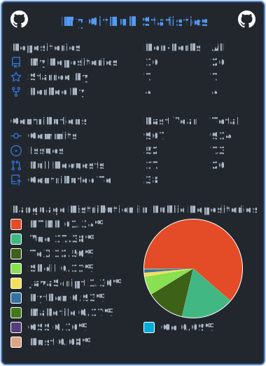

# Hi 👋, I'm hiifong!

[](https://github.com/hiifong)

📕  Latest Blog Posts
<!-- BLOG-POST-LIST:START -->
- [数据结构与算法之美&lpar;笔记&rpar;](https://i.hiifong.cc/geektime/)
- [vim AnsiEsc脚本](https://i.hiifong.cc/ansiesc/)
- [VSCode报Error Loading Workspace](https://i.hiifong.cc/error-loading-workspace/)
- [PowerShell美化](https://i.hiifong.cc/beautify/)
- [Try Gitea Action](https://i.hiifong.cc/try-gitea-action/)
<!-- BLOG-POST-LIST:END -->


###

<br clear="both">


###

<br clear="both">

<div align="left">
  
  
  
  
  
  
  
  
  
  
  
  
  
  
  
  
  
  
  
  
  
  
  
  
  
  
  
  
  
  
  
  
  
  
  
</div>

###

<div align="left">
  
  
  
  
</div>

###

<!--START_SECTION:waka-->


**🐱 My GitHub Data** 

> 🏆 264 Contributions in the Year 2023
 > 
> 📦 1.0 MB Used in GitHub's Storage 
 > 
> 💼 Opted to Hire
 > 
> 📜 29 Public Repositories 
 > 
> 🔑 27 Private Repositories  
 > 
**I'm a Night 🦉** 

```text
🌞 Morning    40 commits     █░░░░░░░░░░░░░░░░░░░░░░░░   6.38% 
🌆 Daytime    222 commits    ████████░░░░░░░░░░░░░░░░░   35.41% 
🌃 Evening    293 commits    ███████████░░░░░░░░░░░░░░   46.73% 
🌙 Night      72 commits     ██░░░░░░░░░░░░░░░░░░░░░░░   11.48%

```
📅 **I'm Most Productive on Friday** 

```text
Monday       90 commits     ███░░░░░░░░░░░░░░░░░░░░░░   14.35% 
Tuesday      88 commits     ███░░░░░░░░░░░░░░░░░░░░░░   14.04% 
Wednesday    82 commits     ███░░░░░░░░░░░░░░░░░░░░░░   13.08% 
Thursday     86 commits     ███░░░░░░░░░░░░░░░░░░░░░░   13.72% 
Friday       141 commits    █████░░░░░░░░░░░░░░░░░░░░   22.49% 
Saturday     71 commits     ██░░░░░░░░░░░░░░░░░░░░░░░   11.32% 
Sunday       69 commits     ██░░░░░░░░░░░░░░░░░░░░░░░   11.0%

```


📊 **This Week I Spent My Time On** 

```text
⌚︎ Time Zone: Asia/Shanghai

💬 Programming Languages: 
TOML                     45 mins             ██████░░░░░░░░░░░░░░░░░░░   25.99% 
JavaScript               25 mins             ███░░░░░░░░░░░░░░░░░░░░░░   14.65% 
Properties               17 mins             ██░░░░░░░░░░░░░░░░░░░░░░░   10.19% 
CSS                      15 mins             ██░░░░░░░░░░░░░░░░░░░░░░░   8.55% 
Other                    14 mins             ██░░░░░░░░░░░░░░░░░░░░░░░   8.51%

🔥 Editors: 
VS Code                  2 hrs 53 mins       ████████████████████████░   99.18% 
IntelliJ                 1 min               ░░░░░░░░░░░░░░░░░░░░░░░░░   0.82%

🐱‍💻 Projects: 
music-website            1 hr 17 mins        ███████████░░░░░░░░░░░░░░   44.0% 
blog-source              59 mins             ████████░░░░░░░░░░░░░░░░░   34.04% 
gtk-themes               15 mins             ██░░░░░░░░░░░░░░░░░░░░░░░   8.75% 
calamares                14 mins             ██░░░░░░░░░░░░░░░░░░░░░░░   8.12% 
Project_RapidOcrNcnn-1.2.7 mins              █░░░░░░░░░░░░░░░░░░░░░░░░   4.1%

💻 Operating System: 
Windows                  2 hrs 25 mins       ████████████████████░░░░░   82.79% 
Linux                    30 mins             ████░░░░░░░░░░░░░░░░░░░░░   17.21%

```

**I Mostly Code in Vue** 

```text
Vue                      5 repos             ████░░░░░░░░░░░░░░░░░░░░░   16.13% 
HTML                     4 repos             ███░░░░░░░░░░░░░░░░░░░░░░   12.9% 
Java                     4 repos             ███░░░░░░░░░░░░░░░░░░░░░░   12.9% 
C++                      3 repos             ██░░░░░░░░░░░░░░░░░░░░░░░   9.68% 
Shell                    3 repos             ██░░░░░░░░░░░░░░░░░░░░░░░   9.68%

```


 Last Updated on 2023/02/24 12:19:32
<!--END_SECTION:waka-->
