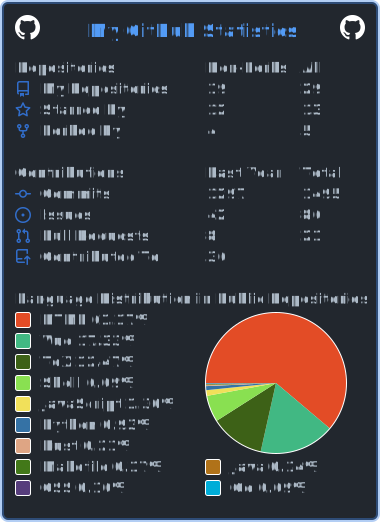

# Hi 👋, I'm hiifong!

## GPG key ID: 0814559E2F97194D
[](https://github.com/hiifong)

📕  Latest Blog Posts
<!-- BLOG-POST-LIST:START -->
- [Go语法](https://hiif.ong/go%E8%AF%AD%E6%B3%95/)
- [hosting your own apt repo&lpar;托管您自己的 apt 仓库&rpar;](https://hiif.ong/hosting-your-own-apt-repo/)
- [Git Atomic Commit&lpar;git原子提交&rpar;](https://hiif.ong/git-atomic-commit/)
- [Custom Neofetch&lpar;自定义neofetch&rpar;](https://hiif.ong/customneofetch/)
- [Journalctl output color log&lpar;`journalctl` 怎么输出彩色日志&rpar;](https://hiif.ong/journalctl-color-log/)
<!-- BLOG-POST-LIST:END -->


###

<br clear="both">


###

<br clear="both">

<div align="left">
  
  
  
  
  
  
  
  
  
  
  
  
  
  
  
  
  
  
  
  
  
  
  
  
  
  
  
  
  
  
  
  
  
  
  
</div>

###

<div align="left">
  
  
  
  
</div>

###

<!--START_SECTION:waka-->


**🐱 My GitHub Data** 

> 📦 1.0 MB Used in GitHub's Storage 
 > 
> 🏆 466 Contributions in the Year 2023
 > 
> 💼 Opted to Hire
 > 
> 📜 29 Public Repositories 
 > 
> 🔑 27 Private Repositories 
 > 
**I'm a Night 🦉** 

```text
🌞 Morning                78 commits          ⬛⬛⬜⬜⬜⬜⬜⬜⬜⬜⬜⬜⬜⬜⬜⬜⬜⬜⬜⬜⬜⬜⬜⬜⬜   06.60 % 
🌆 Daytime                443 commits         ⬛⬛⬛⬛⬛⬛⬛⬛⬛⬜⬜⬜⬜⬜⬜⬜⬜⬜⬜⬜⬜⬜⬜⬜⬜   37.48 % 
🌃 Evening                479 commits         ⬛⬛⬛⬛⬛⬛⬛⬛⬛⬛⬜⬜⬜⬜⬜⬜⬜⬜⬜⬜⬜⬜⬜⬜⬜   40.52 % 
🌙 Night                  182 commits         ⬛⬛⬛⬛⬜⬜⬜⬜⬜⬜⬜⬜⬜⬜⬜⬜⬜⬜⬜⬜⬜⬜⬜⬜⬜   15.40 % 
```
📅 **I'm Most Productive on Friday** 

```text
Monday                   190 commits         ⬛⬛⬛⬛⬜⬜⬜⬜⬜⬜⬜⬜⬜⬜⬜⬜⬜⬜⬜⬜⬜⬜⬜⬜⬜   16.07 % 
Tuesday                  137 commits         ⬛⬛⬛⬜⬜⬜⬜⬜⬜⬜⬜⬜⬜⬜⬜⬜⬜⬜⬜⬜⬜⬜⬜⬜⬜   11.59 % 
Wednesday                168 commits         ⬛⬛⬛⬛⬜⬜⬜⬜⬜⬜⬜⬜⬜⬜⬜⬜⬜⬜⬜⬜⬜⬜⬜⬜⬜   14.21 % 
Thursday                 165 commits         ⬛⬛⬛⬜⬜⬜⬜⬜⬜⬜⬜⬜⬜⬜⬜⬜⬜⬜⬜⬜⬜⬜⬜⬜⬜   13.96 % 
Friday                   232 commits         ⬛⬛⬛⬛⬛⬜⬜⬜⬜⬜⬜⬜⬜⬜⬜⬜⬜⬜⬜⬜⬜⬜⬜⬜⬜   19.63 % 
Saturday                 145 commits         ⬛⬛⬛⬜⬜⬜⬜⬜⬜⬜⬜⬜⬜⬜⬜⬜⬜⬜⬜⬜⬜⬜⬜⬜⬜   12.27 % 
Sunday                   145 commits         ⬛⬛⬛⬜⬜⬜⬜⬜⬜⬜⬜⬜⬜⬜⬜⬜⬜⬜⬜⬜⬜⬜⬜⬜⬜   12.27 % 
```


📊 **This Week I Spent My Time On** 

```text
🕑︎ Time Zone: Asia/Shanghai

💬 Programming Languages: 
Java                     32 mins             ⬛⬛⬛⬛⬛⬛⬛⬛⬛⬜⬜⬜⬜⬜⬜⬜⬜⬜⬜⬜⬜⬜⬜⬜⬜   34.62 % 
JSON                     27 mins             ⬛⬛⬛⬛⬛⬛⬛⬜⬜⬜⬜⬜⬜⬜⬜⬜⬜⬜⬜⬜⬜⬜⬜⬜⬜   29.16 % 
Properties               20 mins             ⬛⬛⬛⬛⬛⬜⬜⬜⬜⬜⬜⬜⬜⬜⬜⬜⬜⬜⬜⬜⬜⬜⬜⬜⬜   21.85 % 
JavaScript               5 mins              ⬛⬛⬜⬜⬜⬜⬜⬜⬜⬜⬜⬜⬜⬜⬜⬜⬜⬜⬜⬜⬜⬜⬜⬜⬜   06.22 % 
SQL                      5 mins              ⬛⬜⬜⬜⬜⬜⬜⬜⬜⬜⬜⬜⬜⬜⬜⬜⬜⬜⬜⬜⬜⬜⬜⬜⬜   05.30 % 

🔥 Editors: 
IntelliJ                 59 mins             ⬛⬛⬛⬛⬛⬛⬛⬛⬛⬛⬛⬛⬛⬛⬛⬛⬜⬜⬜⬜⬜⬜⬜⬜⬜   62.90 % 
VS Code                  35 mins             ⬛⬛⬛⬛⬛⬛⬛⬛⬛⬜⬜⬜⬜⬜⬜⬜⬜⬜⬜⬜⬜⬜⬜⬜⬜   37.10 % 

🐱‍💻 Projects: 
Lib                      40 mins             ⬛⬛⬛⬛⬛⬛⬛⬛⬛⬛⬛⬜⬜⬜⬜⬜⬜⬜⬜⬜⬜⬜⬜⬜⬜   42.76 % 
ThorUi-uniapp            19 mins             ⬛⬛⬛⬛⬛⬜⬜⬜⬜⬜⬜⬜⬜⬜⬜⬜⬜⬜⬜⬜⬜⬜⬜⬜⬜   20.15 % 
Library                  18 mins             ⬛⬛⬛⬛⬛⬜⬜⬜⬜⬜⬜⬜⬜⬜⬜⬜⬜⬜⬜⬜⬜⬜⬜⬜⬜   19.93 % 
Uhuo                     12 mins             ⬛⬛⬛⬜⬜⬜⬜⬜⬜⬜⬜⬜⬜⬜⬜⬜⬜⬜⬜⬜⬜⬜⬜⬜⬜   12.76 % 
soft-plus                2 mins              ⬛⬜⬜⬜⬜⬜⬜⬜⬜⬜⬜⬜⬜⬜⬜⬜⬜⬜⬜⬜⬜⬜⬜⬜⬜   02.90 % 

💻 Operating System: 
Windows                  1 hr 34 mins        ⬛⬛⬛⬛⬛⬛⬛⬛⬛⬛⬛⬛⬛⬛⬛⬛⬛⬛⬛⬛⬛⬛⬛⬛⬛   100.00 % 
```

**I Mostly Code in Go** 

```text
Go                       15 repos            ⬛⬛⬛⬛⬛⬛⬜⬜⬜⬜⬜⬜⬜⬜⬜⬜⬜⬜⬜⬜⬜⬜⬜⬜⬜   22.73 % 
Vue                      7 repos             ⬛⬛⬛⬜⬜⬜⬜⬜⬜⬜⬜⬜⬜⬜⬜⬜⬜⬜⬜⬜⬜⬜⬜⬜⬜   10.61 % 
Shell                    7 repos             ⬛⬛⬛⬜⬜⬜⬜⬜⬜⬜⬜⬜⬜⬜⬜⬜⬜⬜⬜⬜⬜⬜⬜⬜⬜   10.61 % 
Java                     5 repos             ⬛⬛⬜⬜⬜⬜⬜⬜⬜⬜⬜⬜⬜⬜⬜⬜⬜⬜⬜⬜⬜⬜⬜⬜⬜   07.58 % 
Makefile                 4 repos             ⬛⬛⬜⬜⬜⬜⬜⬜⬜⬜⬜⬜⬜⬜⬜⬜⬜⬜⬜⬜⬜⬜⬜⬜⬜   06.06 % 
```


**Timeline**


 Last Updated on 2023/04/02 16:15:22 UTC
<!--END_SECTION:waka-->
